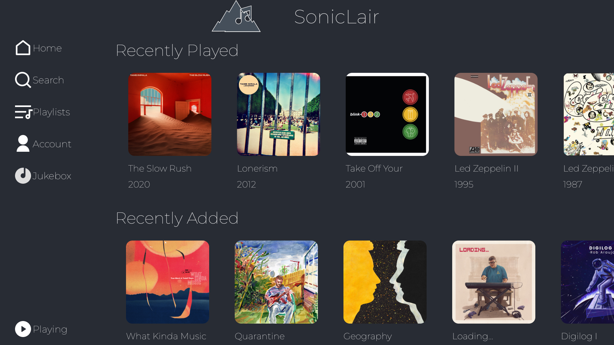

# Soniclair

   

## An album-centered subsonic client for PWA, Android, Android TV and Desktop

SonicLair is a minimal, mobile-ready, album-centered music client for subsonic compatible music servers built on top of [Capacitor] and [Tauri].

Now available for [Xbox](https://github.com/thelinkin3000/SonicLairXbox) too!

## Features

-   Connect to any subsonic-compatible music server. Tested on Navidrome.
-   Browse your music collection by Artist or Album.
-   Album-centered music playing: if you start playing a song, the album becomes your playlist.
-   Start a radio based on any song on your library.
-   Search throughout your entire music library.
-   Android Auto support. (You can use it enabling Developer Mode and Unknown Sources in Android Auto, [here] is a tutorial to do so, thanks to the folks at [Ultrasonic])
-   Android TV support.
-   [Android TV] Connect your TV to your server using your phone and a QR Code. (All the communications are made within the LAN, no third-party servers involved)
-   [Android TV] Jukebox Mode! Run an instance of Soniclair in an Android TV and control it from another instance running on Android. No support for PWA clients as of yet.

## Screenshots

### Phone

### TV

## Installation and Usage

### Android

Built by Github Actions from this very source code.

### Web

To use the PWA version of the app, you can go to [Soniclair], thanks to the fine folks at [Vercel]. Remember that using this version of the app needs your server to use encryption, i.e. it needs to use an https://{domain}, because modern browsers don't support connection downgrading.

### Xbox

Now available for Xbox too!

## Roadmap

-   Chromecast support

## Projects leveraged here

Soniclair is built upon

-   [Capacitor] (used to run the app on Android devices)
-   [Tauri] (used to run the app as a native desktop app)
-   [React JS]
-   [React Window]
-   [React Helmet]
-   [Lodash]
-   [VLC] (as an audio backend for android)
-   [Norigin Spatial Navigation] (used to build an easily navigable UI on Android TV)
-   [Dillinger] (used to write this README)

## Contribute

I'm not planning on receiving contributions yet, although you can fork this repo at your heart's desire!
Soon, though.

## License

MIT, see LICENSE for more info.
But basically, you can do whatever you want with this code.

[//]: # "These are reference links used in the body of this note and get stripped out when the markdown processor does its job. There is no need to format nicely because it shouldn't be seen. Thanks SO - http://stackoverflow.com/questions/4823468/store-comments-in-markdown-syntax"
[capacitor]: https://capacitorjs.com/r
[tauri]: https://tauri.studio/
[react js]: https://reactjs.org/
[react window]: https://github.com/bvaughn/react-window
[react helmet]: https://github.com/nfl/react-helmet
[lodash]: https://lodash.com/
[vlc]: https://www.videolan.org/
[dillinger]: https://github.com/joemccann/dillinger
[norigin spatial navigation]: ohttps://github.com/NoriginMedia/Norigin-Spatial-Navigation
[soniclair]: https://soniclair.vercel.app/
[here]: https://github.com/ultrasonic/ultrasonic/wiki/Using-Ultrasonic-with-Android-Auto
[ultrasonic]: https://github.com/ultrasonic/ultrasonic
[vercel]: https://vercel.com
